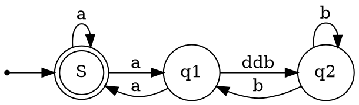

# set up input data
title the retool JSON export file as `raw_data.json` and place in the `/inputs` folder
--> `/inputs/raw_data.json`


## linux
```
chmod +x execute.sh
./execute.sh
```

## windows
```
cd code
.\execute.ps1
```

